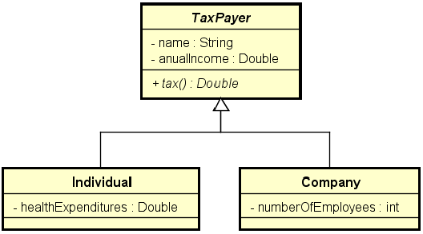

# Exercicio de Fixação Classes Abstratas
Material didático para exemplificar o uso de classes e métodos abstratos.

Fazer um programa para ler os dados de N contribuintes (N fornecido pelo usuário), os quais podem ser pessoa física ou pessoa jurídica, e depois mostrar o valor do imposto pago por cada um,
bem como o total de imposto arrecadado.   
Os dados de pessoa física são: nome, renda anual e gastos com saúde.  
Os dados de pessoa jurídica são nome, renda anual e número de funcionários.   
As regras para cálculo de imposto são as seguintes:  
<b>Pessoa física:</b> pessoas cuja renda foi abaixo de 20000.00 pagam 15% de imposto. Pessoas com renda de 20000.00 em diante pagam 25% de imposto. Se a pessoa teve gastos com saúde, 
50% destes gastos são abatidos no imposto.  
<b>Exemplo:</b> uma pessoa cuja renda foi 50000.00 e teve 2000.00 em gastos com saúde, o imposto fica: (50000 * 25%) - (2000 * 50%) = 11500.00   
<b>Pessoa jurídica:</b> pessoas jurídicas pagam 16% de imposto. Porém, se a empresa possuir mais de 10 funcionários, ela paga 14% de imposto.  
<b>Exemplo:</b> uma empresa cuja renda foi 400000.00 e possui 25 funcionários, o imposto fica: 400000 * 14% = 56000.00   

